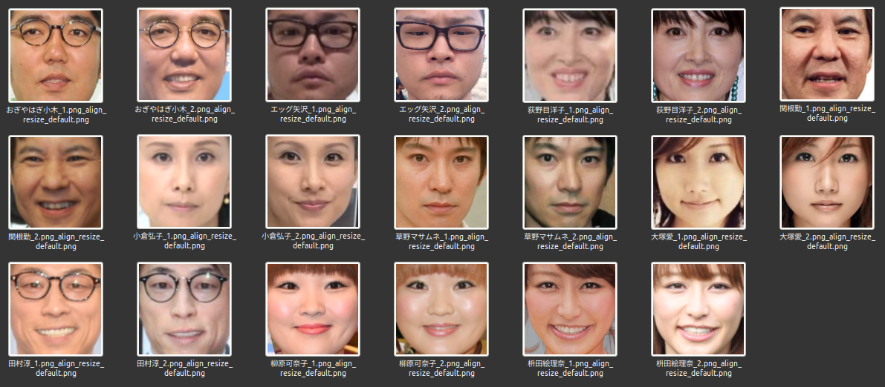
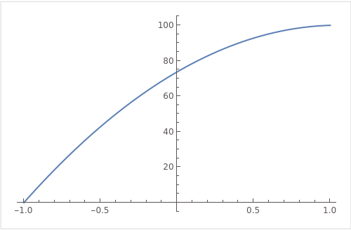

<div align="center">


日本人用顔認証学習モデル
___
</div>

# ℹ️ Note
- ここに置いてある学習モデルについて。
  - 日本人の顔認証を目的としています。
  - 無料でお使いいただけます。ご使用時に著作権表示をして下さい。
  - 商用利用されたい場合はライセンスが必要です。

# 日本人顔認識のための新たな学習モデルを作成 ~ `EfficientNetV2`ファインチューニング ~

1. [ℹ️ Note](#ℹ️-note)
2. [日本人顔認識のための新たな学習モデルを作成 ~ `EfficientNetV2`ファインチューニング ~](#日本人顔認識のための新たな学習モデルを作成--efficientnetv2ファインチューニング-)
   1. [導入](#導入)
   2. [方法](#方法)
   3. [実装](#実装)
   4. [日本人顔画像データセット](#日本人顔画像データセット)
      1. [スクレイピング](#スクレイピング)
      2. [顔領域の切り出し](#顔領域の切り出し)
      3. [別人画像の削除](#別人画像の削除)
         1. [処理のキモ](#処理のキモ)
         2. [ディレクトリの逐次削除](#ディレクトリの逐次削除)
   5. [結果と評価](#結果と評価)
      1. [評価用データセット](#評価用データセット)
      2. [推論コード](#推論コード)
         1. [閾値と百分率](#閾値と百分率)
      3. [結果](#結果)
         1. [精度 (Accuracy): 98.9](#精度-accuracy-989)
         2. [`dlib`学習モデルとの比較](#dlib学習モデルとの比較)
            1. [`dlib_predict.py`](#dlib_predictpy)
            2. [実行結果](#実行結果)
   6. [まとめ](#まとめ)
3. [See also](#see-also)


## 導入

顔認識技術は、スマートフォンのロック解除から空港のシステムまで、私たちの生活のあらゆる面で使用されています。しかしOSSの既存顔認識モデルである`dlib_face_recognition_resnet_model_v1.dat`は、白人の顔に対する精度は高いものの、それ以外の人種、特に日本人の顔に対する精度が低いという問題があります。

この問題を解決するために、この記事では日本人専用の顔認識システム用学習モデルの開発について説明します。効率的な学習モデルである`EfficientNetV2-S`と`arcface損失関数`を組み合わせることで、日本人の顔認証の精度を向上させることを目指しました。

[FACE01](https://github.com/yKesamaru/FACE01_SAMPLE) (顔認証システムを簡単に構築できるライブラリ) で採用している顔認識モデルの`dlib_face_recognition_resnet_model_v1.dat`は、`LFW` (Labeled Faces in the Wild) データセットにおいて99.38%の精度を達成しています。しかしこのモデルは白人に対する精度は高いものの、それ以外の人種、特に日本人に対する精度は低いという問題がありました。そのため、これまでは認識精度を向上させるためにしきい値を調整するなどの対策が必要でした。またしきい値を調整してもなお`False Positive (偽陽性)`が一定値存在する問題が残っていました。

そこで、日本人の顔データセット(2623ids, 271,875枚)を使用して新たな顔認識モデルを開発することにしました。データセットが小さいため、大規模な画像データセットである`ImageNet`で事前学習された`EfficientNetV2`をベースにファインチューニングを行いました。

結果として新たに開発した学習モデルは`26MB`と、既存のdlibモデル（`22.5MB`）よりわずかに大きいサイズとなりましたが、同等の計算リソースでより高精度な日本人の顔認証が可能となりました。また、今回は時間の制約上簡易的な検証ですが、学習データセットにない日本人に対し`98.9%`の精度を達成しました。特に`Dlib`の学習モデルが`False Positive (偽陽性)`を出しやすい`日本人`に対して、`False Positive`を`0`に抑えることができました。

今後の展望としては、`MobileFaceNets`を使用してゼロから学習することでモデルの軽量化を目指します。これによりさらに効率的な顔認証システムの開発を進めていく予定です。

また今回学習されたモデルは、次期バージョンの`FACE01`の顔認証システムに採用する予定です。

## 方法

大規模な画像データセットである`ImageNet`で事前学習された`EfficientNetV2`をベースに、日本人の顔データセットでファインチューニングを行いました。また、学習時の損失関数として`ArcFace`を採用しました。これにより、特徴空間での顔の分離を改善し、日本人の顔認識精度を大幅に向上できました。

- [EfficientNetV2: Smaller Models and Faster Training](https://arxiv.org/abs/2104.00298)
- [ArcFace: Additive Angular Margin Loss for Deep Face Recognition](https://arxiv.org/abs/1801.07698)
- [pytorch-image-models](https://github.com/huggingface/pytorch-image-models)

## 実装

今回の実装では、`EfficientNetV2-S`と`ArcFace`を組み合わせた新たなモデルを開発します。以下にその詳細を示します。

まず、必要なライブラリをインポートします。

```python
import matplotlib.pyplot as plt
import numpy as np
import pytorch_metric_learning
import timm  # timmをインポート
import torch.nn as nn
import torch.onnx  # ONNXをインポート
import torchvision
import umap  # UMAPをインポート
from pytorch_metric_learning import losses, regularizers, samplers
from sklearn.model_selection import StratifiedShuffleSplit
from torch.utils.data import DataLoader
from torch.utils.tensorboard.writer import \
    SummaryWriter  # tensorboardのSummaryWriterをインポート
from torchvision import datasets, transforms
```

次に、乱数シードを固定します。これにより、実験の再現性が確保されます。

```python
def fix_seed(seed):
    # random
    random.seed(seed)
    # numpy
    np.random.seed(seed)
    # pytorch
    torch.manual_seed(seed)
    torch.cuda.manual_seed_all(seed)
    torch.backends.cudnn.deterministic = True
    torch.backends.cudnn.benchmark = False
```

次に、`EfficientNetV2-S`と`ArcFaceLoss`を組み合わせた新たなモデルを定義します。

```python
class CustomModel(nn.Module):
    def __init__(self, embedding_dim=embedding_size):
        super(CustomModel, self).__init__()

        # EfficientNet V2の事前学習済みモデルを取得し、trunkとして定義
        self.trunk = timm.create_model('tf_efficientnetv2_b0', pretrained=True)
        num_features = self.trunk.classifier.in_features  # `_fc`属性を使用する

        # trunkの最終層にembedding_size次元のembedder層を追加
        self.trunk.classifier = nn.Linear(num_features, embedding_dim)

    def forward(self, x):
        return self.trunk(x)
```

最後に、学習ループを定義します。ここでは、各エポックでの訓練と検証、モデルの保存、早期終了の処理などを行います。

```python
for epoch in range(epoch, num_epochs):
    # 省略: 訓練フェーズのコード

    # 検証フェーズ
    val_loss = evaluate(val_dataloader, model, criterion, device)
    print(f'Epoch [{epoch + 1}/{num_epochs}], Val Loss: {val_loss}')
    writer.add_scalar("Loss/val", val_loss, epoch)

    # 追加: 早期終了の処理
    if val_loss < best_loss:
        best_loss = val_loss
        early_stopping_counter = 0
        # 保存するモデルのパスを設定
        model_path = "best_model.pth"
        torch.save(model.state_dict(), model_path)
    else:
        early_stopping_counter += 1
        print(f"Early stopping counter: {early_stopping_counter}")
        if early_stopping_counter >= patience:  # 指定した回数連続で改善しなかったら、学習を停止
            print("Early stopping")
            break

    # 各エポックごとにモデルを保存（チェックポイント）
    save_checkpoint(model, optimizer, epoch, loss, "checkpoint.pth")
```

UMAPによる可視化結果


## 日本人顔画像データセット
MicroSoftによる`MS-Celeb-1M`が非公開になったことは顔認証に関わる方なら記憶にあることと思います。顔データセットは肖像権やプライバシーと無関係ではないため、データセットの公開には慎重な対応が必要です。
ですのでここでは手法と実際のコードについて説明します。

### スクレイピング
省略

### 顔領域の切り出し
`FACE01`ライブラリの`Utils`クラスを用います。
```python
# `sys.path`に`FACE01`ライブラリのパスを追加
sys.path.append('FACE01')
from face01lib.utils import Utils  # type: ignore
Utils_obj = Utils()

# `crop_face`関数を定義
def crop_face(file_path):
    Utils_obj.align_and_resize_maintain_aspect_ratio(
        path=file_path,
        padding=0.4,
        size=224
    )
# 並行処理
max_workers = 4
with concurrent.futures.ProcessPoolExecutor(max_workers=max_workers) as executor:
    executor.map(crop_face, crop_file_path_list)
```

実際にはCPU温度が高くなりすぎてしまうため、`Utils`クラスの`time_sleep`関数を用いてCPU温度を監視し、指定時間処理を停止させる処理を適宜はさみます。
```python
# CPU温度が72度を超えていたら待機
Utils_obj.temp_sleep()
```

### 別人画像の削除
`FACE01`ライブラリの`Utils`, `load_preset_image`, `Dlib_api`クラスを用います。
```python
sys.path.insert(1, 'FACE01')
from face01lib import load_preset_image
from face01lib.api import Dlib_api
from face01lib.utils import Utils

Dlib_api_obj = Dlib_api()
Utils_obj = Utils()
```
#### 処理のキモ
- 顔画像から顔特徴量を抽出します。
```python
known_face_encodings_list, known_face_names_list = \
    load_preset_image.load_preset_image(
        RootDir=dir_folder_path,
        preset_face_imagesDir=dir_folder_path,
        upsampling=0,
        jitters=0,
        mode='hog',
        model='small'
    )
```
- 別人の顔画像を検索して削除します。
```python
pairs = itertools.product(default_datas.items(), other_datas.items())
threshold_same_person: float = 0.4  # 任意
for pair in pairs:
    # CPU温度チェック
    Utils_obj.temp_sleep()
    cp_distance = cp.linalg.norm(
        pair[0][1] - \
        pair[1][1],
        ord=2, axis=None
        )
    if cp_distance < threshold_same_person:  # 同一人物と判定
        continue
    elif cp_distance > threshold_not_person:  # 意味のない写真や画像と判断
        # ファイルを削除
        try:
            os.remove(os.path.join(dir_folder_path, pair[1][0]))
        except Exception as e:
            print(f"error: {e}")
            traceback.print_exc()
    else:  # 顔が写っているが、別人と判断
        print(pair[0][0])
        print(pair[1][0])
        os.rename(
            os.path.join(dir_folder_path, pair[1][0]),
            os.path.join(dir_folder_path, 'not_me', pair[1][0])
          )
```
`cupy`ライブラリがキモです。`cupy`は`numpy`と同じように使えるGPU対応のライブラリです。`cupy.linalg.norm`関数は`numpy.linalg.norm`関数と同じですが、GPUを使用して計算を行うことができます。`cupy.linalg.norm`関数を使用することで、顔画像の顔特徴量を抽出する処理をCPUで行うよりも高速に処理することができます。

- 同一顔画像を検索して 'same_face'フォルダに隔離します。
```python
def distances_per_pair(all_datas, dir_folder_path, threshold_same_person) -> None:
    # CPU温度チェック
    Utils_obj.temp_sleep()

    combination = itertools.combinations(all_datas.keys(), 2)
    print(
        f'Search for combinations of {len(list(combination))} pairs.'
    )
    print('Calculating distances between pairs...')
    for pair in tqdm(list(itertools.combinations(all_datas.keys(), 2))):
        cp_distance = cp.linalg.norm(
            all_datas[pair[0]] - \
            all_datas[pair[1]],
            ord=2, axis=None
            )
        if cp_distance > 0.1:
            continue
        else:
            try:
                # pair[0]が文字列`default`を含まない場合、'same_face'フォルダに移動
                if 'default' not in pair[0]:
                    os.rename(
                        os.path.join(dir_folder_path, pair[0]),
                        os.path.join(dir_folder_path, 'same_face', pair[0])
                    )
            except Exception as e:
                print(f"error: {e}")
                traceback.print_exc()
    # 'same_face'フォルダの中に'default'文字列を含むファイルがあれば、'dir_folder_path'フォルダに移動
    same_face_dir_path = os.path.join(dir_folder_path, 'same_face')
    same_face_dir_files = os.listdir(same_face_dir_path)
    for same_face_dir_file in same_face_dir_files:
        if 'default' in same_face_dir_file:
            os.rename(
                os.path.join(same_face_dir_path, same_face_dir_file),
                os.path.join(dir_folder_path, same_face_dir_file)
            )
    # 処理が終わったことを示すファイルを作成
    with open(os.path.join(dir_folder_path, 'finished.txt'), mode='w') as f:
        f.write('finished')
    filename = str(threshold_same_person) + '.txt'
    with open(os.path.join(dir_folder_path, filename), mode='w') as f:
        f.write('finished')
    return

# same_face処理
distances_per_pair(all_datas, dir_folder_path, threshold_same_person)
```
#### ディレクトリの逐次削除
スクレイプ直後は4000ids程度あったデータセットですが、別人顔画像の削除をした結果1ディレクトリあたり80枚を満たないディレクトリは削除することで最終的に2000ids程度のデータセットになりました。
```python
import os
import shutil

number = 80
root_dir = "スクレイプ終了"

for subdir in os.listdir(root_dir):
    subdir_path = os.path.join(root_dir, subdir)
    if os.path.isdir(subdir_path):
        # もし`noFace`ディレクトリならばスキップ
        if subdir == "noFace":
            continue
        png_count = len([name for name in os.listdir(subdir_path) if name.endswith(".png")])

        not_me_dir = os.path.join(subdir_path, "not_me")
        if os.path.exists(not_me_dir):
            png_count += len([name for name in os.listdir(not_me_dir) if name.endswith(".png")])
        
        if png_count < number:
            # ディレクトリを削除する
            shutil.rmtree(subdir_path)

exit()
```

## 結果と評価
### 評価用データセット
LWFデータセットを用いて既存のモデルと新たに開発したモデルの性能を比較してもよいのですが、LWFデータセットには日本人以外の顔画像がより多く含まれているため今回の主旨にはあいません。そこで、日本人の顔画像を含むデータセットを用いて、既存のモデルと新たに開発したモデルの性能を比較することにします。この時、学習に用いたデータセットとは異なるデータセットを用いることで、モデルの汎化性能を評価することができます。

本来であればそれ用にスクレイピングした日本人の顔画像を含むデータセットを作成し、日本人の顔認識の精度を評価しするところですが、ここでは時間の都合上、学習データセットにない20ids, 20枚の顔画像を用いて評価を行います。これらの全組み合わせは190組あります。この190組の顔画像のうち、同一人物の顔画像の組み合わせは20組あります。この20組の顔画像の組み合わせを同一人物と判断できるかどうか（その逆も）を評価します。


### 推論コード
時間の関係上、以下の推論コードは前処理などがベタ書きしてあります。
```python
import os
from itertools import combinations

import numpy as np
import onnx
import onnxruntime as ort
import torchvision.transforms as transforms
from PIL import Image

model_name = 'efficientnetv2_arcface.onnx'
optimal_threshold = 0.4

# 画像の前処理を定義
mean_value = [0.485, 0.456, 0.406]
std_value = [0.229, 0.224, 0.225]
transform = transforms.Compose([
    transforms.Resize((224, 224)),
    transforms.ToTensor(),
    transforms.Normalize(
        mean=mean_value,
        std=std_value
    )
])

# ONNXモデルをロード
onnx_model = onnx.load(model_name)
ort_session = ort.InferenceSession(model_name)

# 署名表示
for prop in onnx_model.metadata_props:
    if prop.key == "signature":
        print(prop.value)

# 入力名を取得
input_name = onnx_model.graph.input[0].name

# 推論対象の画像ファイルを取得
image_dir = "predict_test"
image_files = [os.path.join(image_dir, f) for f in os.listdir(image_dir) if f.endswith('.png')]

# 類似度判断の関数
def is_same_person(embedding1, embedding2, threshold):
    embedding1 = embedding1.flatten()
    embedding2 = embedding2.flatten()
    cos_sim = np.dot(embedding1, embedding2) / (np.linalg.norm(embedding1) * np.linalg.norm(embedding2))
    return cos_sim >= threshold, cos_sim

# 百分率の計算
def percentage(cos_sim):
    return round(-23.71 * cos_sim ** 2 + 49.98 * cos_sim + 73.69, 2)

# 画像を読み込み、前処理を行い、モデルで推論を行う
embeddings = []
for image_file in image_files:
    image = Image.open(image_file).convert('RGB')
    image = transform(image)
    image = image.unsqueeze(0)  # バッチ次元を追加
    image = image.numpy()
    embedding = ort_session.run(None, {input_name: image})[0]
    embeddings.append(embedding)

# すべての画像ペアの類似度を計算
for (file1, embedding1), (file2, embedding2) in combinations(zip(image_files, embeddings), 2):
    similarity, cos_sim = is_same_person(embedding1, embedding2, optimal_threshold)
    print(f"{file1}, {file2}, {similarity}, {percentage(cos_sim)}%")
```

#### 閾値と百分率
コサイン類似度
$ y = -23.71x^2 + 49.98x + 73.69 $として閾値を設定すると、以下のようになります。横軸がコサイン類似度（この場合は閾値）、縦軸が百分率です。閾値が0.4の時に、スコア90%以上の顔画像ペアが同一人物と判断されるようにしました。



### 結果
#### 精度 (Accuracy): 98.9
$Accuracy = 98.9 $となりました。20組のうち、2組のみ誤判定となりました。
この2組は`False Negative`となっており、同一人物の顔画像ペアを異なる人物と判断 (それぞれ86%, 87%) しています。具体的には以下のとおりです。
```
predict_test/荻野目洋子_2.png_align_resize_default.png	 predict_test/荻野目洋子_1.png_align_resize_default.png	FALSE	86%
predict_test/小倉弘子_1.png_align_resize_default.png	 predict_test/小倉弘子_2.png_align_resize_default.png	FALSE	87%
```

全ての組み合わせ結果を以下に示します。
```
predict_test/田村淳_2.png_align_resize_default.png	 predict_test/柳原可奈子_2.png_align_resize_default.png	FALSE	68%		
predict_test/エッグ矢沢_1.png_align_resize_default.png	 predict_test/おぎやはぎ小木_1.png_align_resize_default.png	FALSE	69%		
predict_test/エッグ矢沢_2.png_align_resize_default.png	 predict_test/関根勤_1.png_align_resize_default.png	FALSE	69%		
predict_test/エッグ矢沢_2.png_align_resize_default.png	 predict_test/関根勤_2.png_align_resize_default.png	FALSE	69%		
predict_test/大塚愛_2.png_align_resize_default.png	 predict_test/田村淳_1.png_align_resize_default.png	FALSE	70%		
predict_test/柳原可奈子_2.png_align_resize_default.png	 predict_test/田村淳_1.png_align_resize_default.png	FALSE	71%		
predict_test/草野マサムネ_2.png_align_resize_default.png	 predict_test/大塚愛_1.png_align_resize_default.png	FALSE	71%		
predict_test/エッグ矢沢_1.png_align_resize_default.png	 predict_test/おぎやはぎ小木_2.png_align_resize_default.png	FALSE	71%		
predict_test/田村淳_2.png_align_resize_default.png	 predict_test/小倉弘子_2.png_align_resize_default.png	FALSE	71%		
predict_test/関根勤_1.png_align_resize_default.png	 predict_test/エッグ矢沢_1.png_align_resize_default.png	FALSE	71%		
predict_test/エッグ矢沢_1.png_align_resize_default.png	 predict_test/小倉弘子_1.png_align_resize_default.png	FALSE	71%		
predict_test/枡田絵理奈_2.png_align_resize_default.png	 predict_test/田村淳_1.png_align_resize_default.png	FALSE	71%		
predict_test/枡田絵理奈_2.png_align_resize_default.png	 predict_test/おぎやはぎ小木_2.png_align_resize_default.png	FALSE	71%		
predict_test/エッグ矢沢_1.png_align_resize_default.png	 predict_test/柳原可奈子_1.png_align_resize_default.png	FALSE	72%		
predict_test/小倉弘子_2.png_align_resize_default.png	 predict_test/田村淳_1.png_align_resize_default.png	FALSE	72%		
predict_test/柳原可奈子_1.png_align_resize_default.png	 predict_test/田村淳_2.png_align_resize_default.png	FALSE	72%		
predict_test/エッグ矢沢_2.png_align_resize_default.png	 predict_test/小倉弘子_1.png_align_resize_default.png	FALSE	72%		
predict_test/枡田絵理奈_2.png_align_resize_default.png	 predict_test/大塚愛_1.png_align_resize_default.png	FALSE	72%		
predict_test/大塚愛_2.png_align_resize_default.png	 predict_test/柳原可奈子_2.png_align_resize_default.png	FALSE	72%		
predict_test/おぎやはぎ小木_1.png_align_resize_default.png	 predict_test/柳原可奈子_2.png_align_resize_default.png	FALSE	72%		
predict_test/エッグ矢沢_2.png_align_resize_default.png	 predict_test/小倉弘子_2.png_align_resize_default.png	FALSE	72%		
predict_test/エッグ矢沢_2.png_align_resize_default.png	 predict_test/おぎやはぎ小木_1.png_align_resize_default.png	FALSE	72%		
predict_test/草野マサムネ_2.png_align_resize_default.png	 predict_test/エッグ矢沢_2.png_align_resize_default.png	FALSE	72%		
predict_test/エッグ矢沢_1.png_align_resize_default.png	 predict_test/小倉弘子_2.png_align_resize_default.png	FALSE	73%		
predict_test/エッグ矢沢_1.png_align_resize_default.png	 predict_test/枡田絵理奈_1.png_align_resize_default.png	FALSE	73%		
predict_test/エッグ矢沢_1.png_align_resize_default.png	 predict_test/関根勤_2.png_align_resize_default.png	FALSE	73%		
predict_test/エッグ矢沢_2.png_align_resize_default.png	 predict_test/枡田絵理奈_2.png_align_resize_default.png	FALSE	73%		
predict_test/荻野目洋子_2.png_align_resize_default.png	 predict_test/おぎやはぎ小木_1.png_align_resize_default.png	FALSE	73%		
predict_test/草野マサムネ_1.png_align_resize_default.png	 predict_test/大塚愛_1.png_align_resize_default.png	FALSE	73%		
predict_test/エッグ矢沢_1.png_align_resize_default.png	 predict_test/枡田絵理奈_2.png_align_resize_default.png	FALSE	73%		
predict_test/荻野目洋子_2.png_align_resize_default.png	 predict_test/大塚愛_1.png_align_resize_default.png	FALSE	73%		
predict_test/大塚愛_2.png_align_resize_default.png	 predict_test/柳原可奈子_1.png_align_resize_default.png	FALSE	73%		
predict_test/関根勤_1.png_align_resize_default.png	 predict_test/荻野目洋子_1.png_align_resize_default.png	FALSE	73%		
predict_test/枡田絵理奈_2.png_align_resize_default.png	 predict_test/おぎやはぎ小木_1.png_align_resize_default.png	FALSE	73%		
predict_test/小倉弘子_1.png_align_resize_default.png	 predict_test/おぎやはぎ小木_2.png_align_resize_default.png	FALSE	73%		
predict_test/柳原可奈子_1.png_align_resize_default.png	 predict_test/おぎやはぎ小木_1.png_align_resize_default.png	FALSE	73%		
predict_test/エッグ矢沢_2.png_align_resize_default.png	 predict_test/大塚愛_2.png_align_resize_default.png	FALSE	73%		
predict_test/エッグ矢沢_1.png_align_resize_default.png	 predict_test/柳原可奈子_2.png_align_resize_default.png	FALSE	73%		
predict_test/エッグ矢沢_2.png_align_resize_default.png	 predict_test/大塚愛_1.png_align_resize_default.png	FALSE	73%		
predict_test/おぎやはぎ小木_1.png_align_resize_default.png	 predict_test/枡田絵理奈_1.png_align_resize_default.png	FALSE	73%		
predict_test/関根勤_1.png_align_resize_default.png	 predict_test/枡田絵理奈_2.png_align_resize_default.png	FALSE	73%		
predict_test/エッグ矢沢_2.png_align_resize_default.png	 predict_test/枡田絵理奈_1.png_align_resize_default.png	FALSE	73%		
predict_test/田村淳_2.png_align_resize_default.png	 predict_test/枡田絵理奈_2.png_align_resize_default.png	FALSE	73%		
predict_test/柳原可奈子_2.png_align_resize_default.png	 predict_test/おぎやはぎ小木_2.png_align_resize_default.png	FALSE	73%		
predict_test/関根勤_1.png_align_resize_default.png	 predict_test/田村淳_2.png_align_resize_default.png	FALSE	74%		
predict_test/柳原可奈子_1.png_align_resize_default.png	 predict_test/田村淳_1.png_align_resize_default.png	FALSE	74%		
predict_test/大塚愛_2.png_align_resize_default.png	 predict_test/小倉弘子_2.png_align_resize_default.png	FALSE	74%		
predict_test/草野マサムネ_2.png_align_resize_default.png	 predict_test/田村淳_2.png_align_resize_default.png	FALSE	74%		
predict_test/田村淳_1.png_align_resize_default.png	 predict_test/枡田絵理奈_1.png_align_resize_default.png	FALSE	74%		
predict_test/関根勤_1.png_align_resize_default.png	 predict_test/大塚愛_1.png_align_resize_default.png	FALSE	74%		
predict_test/荻野目洋子_1.png_align_resize_default.png	 predict_test/おぎやはぎ小木_2.png_align_resize_default.png	FALSE	74%		
predict_test/大塚愛_1.png_align_resize_default.png	 predict_test/田村淳_1.png_align_resize_default.png	FALSE	74%		
predict_test/荻野目洋子_2.png_align_resize_default.png	 predict_test/枡田絵理奈_1.png_align_resize_default.png	FALSE	74%		
predict_test/草野マサムネ_2.png_align_resize_default.png	 predict_test/枡田絵理奈_1.png_align_resize_default.png	FALSE	74%		
predict_test/荻野目洋子_1.png_align_resize_default.png	 predict_test/枡田絵理奈_1.png_align_resize_default.png	FALSE	74%		
predict_test/柳原可奈子_1.png_align_resize_default.png	 predict_test/枡田絵理奈_1.png_align_resize_default.png	FALSE	74%		
predict_test/エッグ矢沢_2.png_align_resize_default.png	 predict_test/柳原可奈子_2.png_align_resize_default.png	FALSE	74%		
predict_test/大塚愛_2.png_align_resize_default.png	 predict_test/おぎやはぎ小木_1.png_align_resize_default.png	FALSE	74%		
predict_test/大塚愛_2.png_align_resize_default.png	 predict_test/おぎやはぎ小木_2.png_align_resize_default.png	FALSE	74%		
predict_test/荻野目洋子_2.png_align_resize_default.png	 predict_test/枡田絵理奈_2.png_align_resize_default.png	FALSE	74%		
predict_test/関根勤_1.png_align_resize_default.png	 predict_test/小倉弘子_1.png_align_resize_default.png	FALSE	74%		
predict_test/おぎやはぎ小木_2.png_align_resize_default.png	 predict_test/枡田絵理奈_1.png_align_resize_default.png	FALSE	74%		
predict_test/関根勤_1.png_align_resize_default.png	 predict_test/枡田絵理奈_1.png_align_resize_default.png	FALSE	74%		
predict_test/草野マサムネ_2.png_align_resize_default.png	 predict_test/柳原可奈子_1.png_align_resize_default.png	FALSE	74%		
predict_test/エッグ矢沢_2.png_align_resize_default.png	 predict_test/草野マサムネ_1.png_align_resize_default.png	FALSE	74%		
predict_test/柳原可奈子_1.png_align_resize_default.png	 predict_test/荻野目洋子_1.png_align_resize_default.png	FALSE	74%		
predict_test/草野マサムネ_2.png_align_resize_default.png	 predict_test/田村淳_1.png_align_resize_default.png	FALSE	74%		
predict_test/柳原可奈子_1.png_align_resize_default.png	 predict_test/おぎやはぎ小木_2.png_align_resize_default.png	FALSE	74%		
predict_test/枡田絵理奈_2.png_align_resize_default.png	 predict_test/関根勤_2.png_align_resize_default.png	FALSE	74%		
predict_test/小倉弘子_2.png_align_resize_default.png	 predict_test/枡田絵理奈_1.png_align_resize_default.png	FALSE	74%		
predict_test/小倉弘子_1.png_align_resize_default.png	 predict_test/田村淳_1.png_align_resize_default.png	FALSE	74%		
predict_test/柳原可奈子_1.png_align_resize_default.png	 predict_test/草野マサムネ_1.png_align_resize_default.png	FALSE	74%		
predict_test/小倉弘子_2.png_align_resize_default.png	 predict_test/おぎやはぎ小木_2.png_align_resize_default.png	FALSE	74%		
predict_test/荻野目洋子_2.png_align_resize_default.png	 predict_test/おぎやはぎ小木_2.png_align_resize_default.png	FALSE	74%		
predict_test/エッグ矢沢_2.png_align_resize_default.png	 predict_test/柳原可奈子_1.png_align_resize_default.png	FALSE	75%		
predict_test/草野マサムネ_2.png_align_resize_default.png	 predict_test/エッグ矢沢_1.png_align_resize_default.png	FALSE	75%		
predict_test/おぎやはぎ小木_1.png_align_resize_default.png	 predict_test/小倉弘子_2.png_align_resize_default.png	FALSE	75%		
predict_test/関根勤_2.png_align_resize_default.png	 predict_test/枡田絵理奈_1.png_align_resize_default.png	FALSE	75%		
predict_test/柳原可奈子_1.png_align_resize_default.png	 predict_test/大塚愛_1.png_align_resize_default.png	FALSE	75%		
predict_test/エッグ矢沢_2.png_align_resize_default.png	 predict_test/おぎやはぎ小木_2.png_align_resize_default.png	FALSE	75%		
predict_test/草野マサムネ_1.png_align_resize_default.png	 predict_test/小倉弘子_2.png_align_resize_default.png	FALSE	75%		
predict_test/小倉弘子_1.png_align_resize_default.png	 predict_test/枡田絵理奈_2.png_align_resize_default.png	FALSE	75%		
predict_test/大塚愛_1.png_align_resize_default.png	 predict_test/小倉弘子_2.png_align_resize_default.png	FALSE	75%		
predict_test/関根勤_1.png_align_resize_default.png	 predict_test/柳原可奈子_1.png_align_resize_default.png	FALSE	75%		
predict_test/荻野目洋子_1.png_align_resize_default.png	 predict_test/おぎやはぎ小木_1.png_align_resize_default.png	FALSE	75%		
predict_test/草野マサムネ_1.png_align_resize_default.png	 predict_test/柳原可奈子_2.png_align_resize_default.png	FALSE	75%		
predict_test/関根勤_2.png_align_resize_default.png	 predict_test/おぎやはぎ小木_2.png_align_resize_default.png	FALSE	75%		
predict_test/関根勤_1.png_align_resize_default.png	 predict_test/大塚愛_2.png_align_resize_default.png	FALSE	75%		
predict_test/草野マサムネ_2.png_align_resize_default.png	 predict_test/大塚愛_2.png_align_resize_default.png	FALSE	75%		
predict_test/柳原可奈子_1.png_align_resize_default.png	 predict_test/関根勤_2.png_align_resize_default.png	FALSE	75%		
predict_test/小倉弘子_1.png_align_resize_default.png	 predict_test/柳原可奈子_1.png_align_resize_default.png	FALSE	75%		
predict_test/大塚愛_1.png_align_resize_default.png	 predict_test/柳原可奈子_2.png_align_resize_default.png	FALSE	75%		
predict_test/大塚愛_2.png_align_resize_default.png	 predict_test/枡田絵理奈_2.png_align_resize_default.png	FALSE	75%		
predict_test/荻野目洋子_1.png_align_resize_default.png	 predict_test/関根勤_2.png_align_resize_default.png	FALSE	75%		
predict_test/枡田絵理奈_2.png_align_resize_default.png	 predict_test/小倉弘子_2.png_align_resize_default.png	FALSE	75%		
predict_test/エッグ矢沢_1.png_align_resize_default.png	 predict_test/大塚愛_2.png_align_resize_default.png	FALSE	75%		
predict_test/荻野目洋子_2.png_align_resize_default.png	 predict_test/大塚愛_2.png_align_resize_default.png	FALSE	75%		
predict_test/草野マサムネ_1.png_align_resize_default.png	 predict_test/おぎやはぎ小木_2.png_align_resize_default.png	FALSE	75%		
predict_test/大塚愛_1.png_align_resize_default.png	 predict_test/おぎやはぎ小木_2.png_align_resize_default.png	FALSE	75%		
predict_test/大塚愛_1.png_align_resize_default.png	 predict_test/関根勤_2.png_align_resize_default.png	FALSE	75%		
predict_test/大塚愛_2.png_align_resize_default.png	 predict_test/荻野目洋子_1.png_align_resize_default.png	FALSE	75%		
predict_test/小倉弘子_1.png_align_resize_default.png	 predict_test/おぎやはぎ小木_1.png_align_resize_default.png	FALSE	75%		
predict_test/関根勤_1.png_align_resize_default.png	 predict_test/荻野目洋子_2.png_align_resize_default.png	FALSE	76%		
predict_test/関根勤_1.png_align_resize_default.png	 predict_test/田村淳_1.png_align_resize_default.png	FALSE	76%		
predict_test/関根勤_1.png_align_resize_default.png	 predict_test/小倉弘子_2.png_align_resize_default.png	FALSE	76%		
predict_test/小倉弘子_1.png_align_resize_default.png	 predict_test/関根勤_2.png_align_resize_default.png	FALSE	76%		
predict_test/荻野目洋子_1.png_align_resize_default.png	 predict_test/柳原可奈子_2.png_align_resize_default.png	FALSE	76%		
predict_test/大塚愛_1.png_align_resize_default.png	 predict_test/枡田絵理奈_1.png_align_resize_default.png	FALSE	76%		
predict_test/草野マサムネ_2.png_align_resize_default.png	 predict_test/柳原可奈子_2.png_align_resize_default.png	FALSE	76%		
predict_test/柳原可奈子_2.png_align_resize_default.png	 predict_test/枡田絵理奈_1.png_align_resize_default.png	FALSE	76%		
predict_test/関根勤_2.png_align_resize_default.png	 predict_test/柳原可奈子_2.png_align_resize_default.png	FALSE	76%		
predict_test/荻野目洋子_2.png_align_resize_default.png	 predict_test/関根勤_2.png_align_resize_default.png	FALSE	76%		
predict_test/荻野目洋子_2.png_align_resize_default.png	 predict_test/田村淳_1.png_align_resize_default.png	FALSE	76%		
predict_test/荻野目洋子_1.png_align_resize_default.png	 predict_test/田村淳_1.png_align_resize_default.png	FALSE	76%		
predict_test/荻野目洋子_1.png_align_resize_default.png	 predict_test/大塚愛_1.png_align_resize_default.png	FALSE	76%		
predict_test/関根勤_1.png_align_resize_default.png	 predict_test/柳原可奈子_2.png_align_resize_default.png	FALSE	76%		
predict_test/草野マサムネ_2.png_align_resize_default.png	 predict_test/小倉弘子_2.png_align_resize_default.png	FALSE	76%		
predict_test/関根勤_2.png_align_resize_default.png	 predict_test/田村淳_1.png_align_resize_default.png	FALSE	76%		
predict_test/エッグ矢沢_1.png_align_resize_default.png	 predict_test/草野マサムネ_1.png_align_resize_default.png	FALSE	76%		
predict_test/大塚愛_1.png_align_resize_default.png	 predict_test/おぎやはぎ小木_1.png_align_resize_default.png	FALSE	76%		
predict_test/田村淳_2.png_align_resize_default.png	 predict_test/関根勤_2.png_align_resize_default.png	FALSE	76%		
predict_test/小倉弘子_1.png_align_resize_default.png	 predict_test/田村淳_2.png_align_resize_default.png	FALSE	77%		
predict_test/田村淳_2.png_align_resize_default.png	 predict_test/荻野目洋子_1.png_align_resize_default.png	FALSE	77%		
predict_test/関根勤_2.png_align_resize_default.png	 predict_test/おぎやはぎ小木_1.png_align_resize_default.png	FALSE	77%		
predict_test/草野マサムネ_2.png_align_resize_default.png	 predict_test/荻野目洋子_1.png_align_resize_default.png	FALSE	77%		
predict_test/草野マサムネ_2.png_align_resize_default.png	 predict_test/枡田絵理奈_2.png_align_resize_default.png	FALSE	77%		
predict_test/荻野目洋子_2.png_align_resize_default.png	 predict_test/田村淳_2.png_align_resize_default.png	FALSE	77%		
predict_test/エッグ矢沢_2.png_align_resize_default.png	 predict_test/田村淳_2.png_align_resize_default.png	FALSE	77%		
predict_test/草野マサムネ_1.png_align_resize_default.png	 predict_test/枡田絵理奈_1.png_align_resize_default.png	FALSE	77%		
predict_test/関根勤_1.png_align_resize_default.png	 predict_test/草野マサムネ_1.png_align_resize_default.png	FALSE	77%		
predict_test/小倉弘子_1.png_align_resize_default.png	 predict_test/柳原可奈子_2.png_align_resize_default.png	FALSE	77%		
predict_test/草野マサムネ_2.png_align_resize_default.png	 predict_test/小倉弘子_1.png_align_resize_default.png	FALSE	77%		
predict_test/小倉弘子_1.png_align_resize_default.png	 predict_test/草野マサムネ_1.png_align_resize_default.png	FALSE	77%		
predict_test/関根勤_2.png_align_resize_default.png	 predict_test/小倉弘子_2.png_align_resize_default.png	FALSE	77%		
predict_test/エッグ矢沢_1.png_align_resize_default.png	 predict_test/大塚愛_1.png_align_resize_default.png	FALSE	77%		
predict_test/荻野目洋子_1.png_align_resize_default.png	 predict_test/枡田絵理奈_2.png_align_resize_default.png	FALSE	77%		
predict_test/草野マサムネ_1.png_align_resize_default.png	 predict_test/田村淳_2.png_align_resize_default.png	FALSE	77%		
predict_test/エッグ矢沢_2.png_align_resize_default.png	 predict_test/荻野目洋子_1.png_align_resize_default.png	FALSE	77%		
predict_test/荻野目洋子_2.png_align_resize_default.png	 predict_test/柳原可奈子_2.png_align_resize_default.png	FALSE	78%		
predict_test/大塚愛_2.png_align_resize_default.png	 predict_test/田村淳_2.png_align_resize_default.png	FALSE	78%		
predict_test/草野マサムネ_2.png_align_resize_default.png	 predict_test/関根勤_1.png_align_resize_default.png	FALSE	78%		
predict_test/荻野目洋子_1.png_align_resize_default.png	 predict_test/小倉弘子_2.png_align_resize_default.png	FALSE	78%		
predict_test/大塚愛_2.png_align_resize_default.png	 predict_test/関根勤_2.png_align_resize_default.png	FALSE	78%		
predict_test/草野マサムネ_1.png_align_resize_default.png	 predict_test/田村淳_1.png_align_resize_default.png	FALSE	78%		
predict_test/小倉弘子_1.png_align_resize_default.png	 predict_test/枡田絵理奈_1.png_align_resize_default.png	FALSE	78%		
predict_test/田村淳_2.png_align_resize_default.png	 predict_test/枡田絵理奈_1.png_align_resize_default.png	FALSE	78%		
predict_test/草野マサムネ_1.png_align_resize_default.png	 predict_test/枡田絵理奈_2.png_align_resize_default.png	FALSE	78%		
predict_test/荻野目洋子_2.png_align_resize_default.png	 predict_test/小倉弘子_1.png_align_resize_default.png	FALSE	78%		
predict_test/大塚愛_2.png_align_resize_default.png	 predict_test/草野マサムネ_1.png_align_resize_default.png	FALSE	78%		
predict_test/小倉弘子_1.png_align_resize_default.png	 predict_test/荻野目洋子_1.png_align_resize_default.png	FALSE	78%		
predict_test/草野マサムネ_2.png_align_resize_default.png	 predict_test/おぎやはぎ小木_2.png_align_resize_default.png	FALSE	78%		
predict_test/草野マサムネ_1.png_align_resize_default.png	 predict_test/荻野目洋子_1.png_align_resize_default.png	FALSE	78%		
predict_test/柳原可奈子_1.png_align_resize_default.png	 predict_test/小倉弘子_2.png_align_resize_default.png	FALSE	79%		
predict_test/草野マサムネ_1.png_align_resize_default.png	 predict_test/おぎやはぎ小木_1.png_align_resize_default.png	FALSE	79%		
predict_test/荻野目洋子_2.png_align_resize_default.png	 predict_test/小倉弘子_2.png_align_resize_default.png	FALSE	79%		
predict_test/関根勤_1.png_align_resize_default.png	 predict_test/おぎやはぎ小木_1.png_align_resize_default.png	FALSE	79%		
predict_test/エッグ矢沢_1.png_align_resize_default.png	 predict_test/荻野目洋子_2.png_align_resize_default.png	FALSE	79%		
predict_test/田村淳_2.png_align_resize_default.png	 predict_test/大塚愛_1.png_align_resize_default.png	FALSE	79%		
predict_test/エッグ矢沢_1.png_align_resize_default.png	 predict_test/荻野目洋子_1.png_align_resize_default.png	FALSE	79%		
predict_test/エッグ矢沢_2.png_align_resize_default.png	 predict_test/荻野目洋子_2.png_align_resize_default.png	FALSE	79%		
predict_test/草野マサムネ_2.png_align_resize_default.png	 predict_test/おぎやはぎ小木_1.png_align_resize_default.png	FALSE	79%		
predict_test/大塚愛_2.png_align_resize_default.png	 predict_test/枡田絵理奈_1.png_align_resize_default.png	FALSE	80%		
predict_test/小倉弘子_1.png_align_resize_default.png	 predict_test/大塚愛_1.png_align_resize_default.png	FALSE	80%		
predict_test/荻野目洋子_2.png_align_resize_default.png	 predict_test/柳原可奈子_1.png_align_resize_default.png	FALSE	80%		
predict_test/エッグ矢沢_2.png_align_resize_default.png	 predict_test/田村淳_1.png_align_resize_default.png	FALSE	80%		
predict_test/荻野目洋子_2.png_align_resize_default.png	 predict_test/草野マサムネ_1.png_align_resize_default.png	FALSE	80%		
predict_test/田村淳_2.png_align_resize_default.png	 predict_test/おぎやはぎ小木_1.png_align_resize_default.png	FALSE	80%		
predict_test/草野マサムネ_2.png_align_resize_default.png	 predict_test/荻野目洋子_2.png_align_resize_default.png	FALSE	80%		
predict_test/小倉弘子_1.png_align_resize_default.png	 predict_test/大塚愛_2.png_align_resize_default.png	FALSE	80%		
predict_test/小倉弘子_2.png_align_resize_default.png	 predict_test/柳原可奈子_2.png_align_resize_default.png	FALSE	81%		
predict_test/柳原可奈子_1.png_align_resize_default.png	 predict_test/枡田絵理奈_2.png_align_resize_default.png	FALSE	81%		
predict_test/おぎやはぎ小木_2.png_align_resize_default.png	 predict_test/田村淳_1.png_align_resize_default.png	FALSE	81%		
predict_test/枡田絵理奈_2.png_align_resize_default.png	 predict_test/柳原可奈子_2.png_align_resize_default.png	FALSE	81%		
predict_test/エッグ矢沢_1.png_align_resize_default.png	 predict_test/田村淳_2.png_align_resize_default.png	FALSE	81%		
predict_test/田村淳_2.png_align_resize_default.png	 predict_test/おぎやはぎ小木_2.png_align_resize_default.png	FALSE	81%		
predict_test/関根勤_1.png_align_resize_default.png	 predict_test/おぎやはぎ小木_2.png_align_resize_default.png	FALSE	82%		
predict_test/エッグ矢沢_1.png_align_resize_default.png	 predict_test/田村淳_1.png_align_resize_default.png	FALSE	82%		
predict_test/おぎやはぎ小木_1.png_align_resize_default.png	 predict_test/田村淳_1.png_align_resize_default.png	FALSE	84%		
predict_test/草野マサムネ_1.png_align_resize_default.png	 predict_test/関根勤_2.png_align_resize_default.png	FALSE	84%		
predict_test/草野マサムネ_2.png_align_resize_default.png	 predict_test/関根勤_2.png_align_resize_default.png	FALSE	84%		
predict_test/荻野目洋子_2.png_align_resize_default.png	 predict_test/荻野目洋子_1.png_align_resize_default.png	FALSE	86%		
predict_test/小倉弘子_1.png_align_resize_default.png	 predict_test/小倉弘子_2.png_align_resize_default.png	FALSE	87%		
predict_test/大塚愛_2.png_align_resize_default.png	 predict_test/大塚愛_1.png_align_resize_default.png	TRUE	90%		
predict_test/エッグ矢沢_2.png_align_resize_default.png	 predict_test/エッグ矢沢_1.png_align_resize_default.png	TRUE	94%		
predict_test/田村淳_2.png_align_resize_default.png	 predict_test/田村淳_1.png_align_resize_default.png	TRUE	94%		
predict_test/おぎやはぎ小木_1.png_align_resize_default.png	 predict_test/おぎやはぎ小木_2.png_align_resize_default.png	TRUE	94%		
predict_test/柳原可奈子_1.png_align_resize_default.png	 predict_test/柳原可奈子_2.png_align_resize_default.png	TRUE	95%		
predict_test/枡田絵理奈_2.png_align_resize_default.png	 predict_test/枡田絵理奈_1.png_align_resize_default.png	TRUE	95%		
predict_test/関根勤_1.png_align_resize_default.png	 predict_test/関根勤_2.png_align_resize_default.png	TRUE	95%		
predict_test/草野マサムネ_2.png_align_resize_default.png	 predict_test/草野マサムネ_1.png_align_resize_default.png	TRUE	98%	Accuracy	0.989473684210526

```


#### `dlib`学習モデルとの比較
[`dlib_face_recognition_resnet_model_v1.dat`を用いた場合全て同一人物と判断されてしまう例 (不正解) ](https://tokai-kaoninsho.com/%e3%82%b3%e3%83%a9%e3%83%a0/%e9%a1%94%e8%aa%8d%e8%a8%bc%e3%82%92%e4%bd%bf%e3%81%a3%e3%81%9f%e3%80%8c%e9%a1%94%e3%81%8c%e4%bc%bc%e3%81%a6%e3%82%8b%e8%8a%b8%e8%83%bd%e4%ba%ba%e3%83%a9%e3%83%b3%e3%82%ad%e3%83%b3%e3%82%b0%e3%80%8d/)を、新しく作成した学習モデルで検証しました。**新しいモデルでは全て別人と判断 (正解) されました**。

##### `dlib_predict.py`
```python
import glob
import os
import sys
from itertools import combinations

import numpy as np

sys.path.append('FACE01')
from face01lib.Calc import Cal
from face01lib.utils import Utils

Utils_obj = Utils()
Cal_obj = Cal()

# 画像の読み込みと類似度の計算
image_dir = "predict_test"
# 画像ファイルのパスを取得
image_paths = glob.glob(os.path.join(image_dir, "*.png"))
embeddings = []

for image_path in image_paths:
    embedding = Utils_obj.get_face_encoding(image_path)
    embeddings.append(embedding)

# 類似度の計算
pairs = list(combinations(range(len(embeddings)), 2))
for i, j in pairs:
    distance = np.linalg.norm(embeddings[i] - embeddings[j])
    percent = round(Cal_obj.to_percentage(distance), 2)
    print(f'{image_paths[i]}, {image_paths[j]}, {percent}%')
```

##### 実行結果
- 新井浩文, 大森南朋
- 
- 新しい学習モデル (`efficientnetv2_arcface.onnx`)
  - `predict_test/新井浩文.png_align_resize.png, predict_test/大森南朋.png_align_resize.png, False, 87.98%`
  - 判定; 別人 **(正解:o:)**
- 既存の学習モデル (`dlib_face_recognition_resnet_model_v1.dat`)
  - `predict_test/新井浩文.png_align_resize.png, predict_test/大森南朋.png_align_resize.png, 98.97%`
  - 判定: 同一人物 **(不正解:x:)**
---
- 新川優愛, 内田理央
- 
- 新しい学習モデル (`efficientnetv2_arcface.onnx`)
  - ` predict_test/新川優愛.png, predict_test/内田理央.png, False, 81.46%`
  - 判定; 別人 **(正解:o:)**
- 既存の学習モデル (`dlib_face_recognition_resnet_model_v1.dat`)
  - `predict_test/内田理央.png_align_resize.png, predict_test/新川優愛.png_align_resize.png, 99.27%`
  - 判定: 同一人物 **(不正解:x:)**
---
- 金正恩, 馬場園梓
- 
- 新しい学習モデル (`efficientnetv2_arcface.onnx`)
  - `predict_test/金正恩.png_align_resize.png, predict_test/馬場園梓.png_align_resize.png, False, 79.87%`
  - 判定; 別人 **(正解:o:)**
- 既存の学習モデル (`dlib_face_recognition_resnet_model_v1.dat`)
  - `predict_test/金正恩.png_align_resize.png, predict_test/馬場園梓.png_align_resize.png, 99.44%`
  - 判定: 同一人物 **(不正解:x:)**
---
- 池田清彦, 西村康稔
- 
- 新しい学習モデル (`efficientnetv2_arcface.onnx`)
  - `predict_test/池田清彦.png_align_resize.png, predict_test/西村康稔.png_align_resize.png, False, 72.26%`
  - 判定; 別人 **(正解:o:)**
- 既存の学習モデル (`dlib_face_recognition_resnet_model_v1.dat`)
  - `predict_test/池田清彦.png_align_resize.png, predict_test/西村康稔.png_align_resize.png, 98.87%`
  - 判定: 同一人物 **(不正解:x:)**
---
- 金正恩, 畑岡奈紗
- 
- 新しい学習モデル (`efficientnetv2_arcface.onnx`)
  `predict_test/金正恩.png_align_resize.png, predict_test/畑岡奈紗.png_align_resize.png, False, 77.82%`
  - 判定; 別人 **(正解:o:)**
- 既存の学習モデル (`dlib_face_recognition_resnet_model_v1.dat`)
  - `predict_test/金正恩.png_align_resize.png, predict_test/畑岡奈紗.png_align_resize.png, 99.37%`
  - 判定: 同一人物 **(不正解:x:)**
---
- 有働由美子, 椎名林檎
- 
- 新しい学習モデル (`efficientnetv2_arcface.onnx`)
  - `predict_test/有働由美子.png_align_resize.png, predict_test/椎名林檎.png_align_resize.png, False, 82.17%`
  - 判定; 別人 **(正解:o:)**
- 既存の学習モデル (`dlib_face_recognition_resnet_model_v1.dat`)
  -`predict_test/有働由美子.png_align_resize.png, predict_test/椎名林檎.png_align_resize.png, 99.16%`
  - 判定: 同一人物 **(不正解:x:)**
---
- 波瑠, 入山杏奈
- 
- 新しい学習モデル (`efficientnetv2_arcface.onnx`)
  - `predict_test/波瑠.png_align_resize.png, predict_test/入山杏奈.png_align_resize.png, False, 81.46%`
  - 判定; 別人 **(正解:o:)**
- 既存の学習モデル (`dlib_face_recognition_resnet_model_v1.dat`)
  - `predict_test/波瑠.png_align_resize.png, predict_test/入山杏奈.png_align_resize.png, 99.07%`
  - 判定: 同一人物 **(不正解:x:)**
---
- 浅田舞, 浅田真央
- 
- 新しい学習モデル (`efficientnetv2_arcface.onnx`)
  - `predict_test/浅田舞.png_align_resize.png, predict_test/浅田真央.png_align_resize.png, False, 83.06%`
  - 判定; 別人 **(正解:o:)**
- 既存の学習モデル (`dlib_face_recognition_resnet_model_v1.dat`)
  - `predict_test/浅田舞.png_align_resize.png, predict_test/浅田真央.png_align_resize.png, 99.27%`
  - 判定: 同一人物 **(不正解:x:)**
---

## まとめ

この記事では日本人の顔認識の精度を向上させるために、`EfficientNetV2`と`ArcFace`を用いた新たなモデルの開発について説明しました。既存のモデルが抱える問題を解決するために日本人の顔データセットを使用し、大規模な画像データセットである`ImageNet`で事前学習された`EfficientNetV2`をベースにモデルをファインチューニングしました。また学習時の損失関数として`ArcFaceLoss`を使用し、特徴空間での顔の分離を改善しました。

この新たなモデルは日本人の顔認識において、既存のモデル( `dlib_face_recognition_resnet_model_v1.dat`) よりも優れた性能を示しました。これにより顔認識技術がさらに多様なシチュエーションに対応できるようになり、その応用範囲が広がることが期待されます。


# See also
- [FACE01](https://github.com/yKesamaru/FACE01_SAMPLE)
  - Face recognition library that integrates various functions and can be called from Python.
