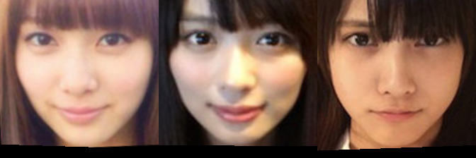
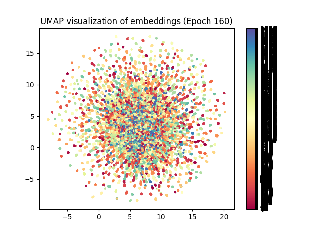
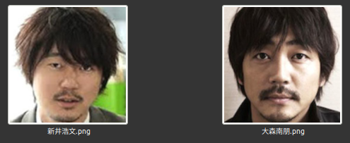
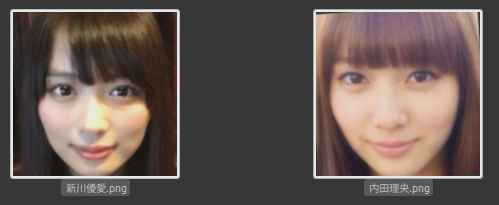
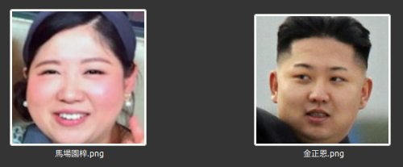
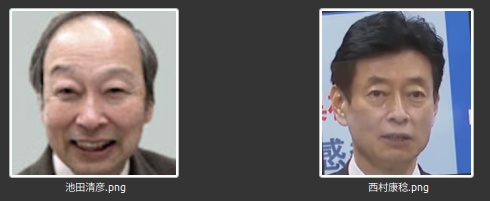
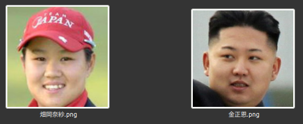
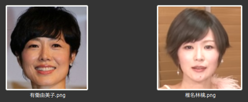
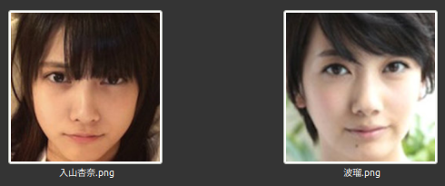
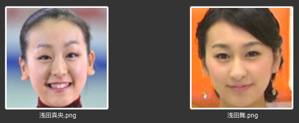

<div align="center">


Face recognition learning model for Japanese people
___
</div>

[Japanese](README.md)

# ℹ️ Note
- About the learning model posted here.
   - Intended for facial recognition of Japanese people.
   - Free to use. Please display copyright notice when using.
   - A license is required if you want to use it commercially.
# New learning model for Japanese face recognition `JAPANESE FACE v1`

- [ℹ️ Note](#ℹ️-note)
- [New learning model for Japanese face recognition `JAPANESE FACE v1`](#new-learning-model-for-japanese-face-recognition-japanese-face-v1)
  - [Introduction](#introduction)
  - [History and features of Dlib](#history-and-features-of-dlib)
  - [`dlib_face_recognition_resnet_model_v1.dat`](#dlib_face_recognition_resnet_model_v1dat)
  - [How to make](#how-to-make)
  - [Performance evaluation of `dlib_face_recognition_resnet_model_v1.dat` and `JAPANESE FACE v1`](#performance-evaluation-of-dlib_face_recognition_resnet_model_v1dat-and-japanese-face-v1)
    - [Performance evaluation for general Japanese people](#performance-evaluation-for-general-japanese-people)
    - [Performance evaluation for young Japanese women](#performance-evaluation-for-young-japanese-women)
- [About `JAPANESE FACE v1`](#about-japanese-face-v1)
  - [Performance evaluation for general Japanese people](#performance-evaluation-for-general-japanese-people-1)
  - [Performance evaluation for young Japanese women](#performance-evaluation-for-young-japanese-women-1)
  - [How to use](#how-to-use)
  - [Comparison with `dlib` learning model](#comparison-with-dlib-learning-model)
    - [`dlib_predict.py`](#dlib_predictpy)
    - [Execution result](#execution-result)
  - [summary](#summary)
  - [See also](#see-also)


## Introduction

以下が英訳です。

Facial recognition technology is used in every aspect of our lives, from unlocking smartphones to airport systems. 

However, the existing face recognition model of OSS, `dlib_face_recognition_resnet_model_v1.dat` from [Dlib](http://blog.dlib.net/2017/02/high-quality-face-recognition-with-deep.html), demonstrates high accuracy for Caucasian faces. Yet, it has a notable issue with its accuracy for other races, especially young Japanese women.


## History and features of Dlib

Dlib is an open source library for machine learning and data analysis originally written in C++. Development began in 2002 by Davis King. Dlib is well known in the field of facial recognition, but its capabilities don't stop there. This library covers a variety of tasks such as image processing, machine learning, natural language processing, and numerical optimization. This library, developed in C++, also provides Python bindings. Development is currently continuing at [dlib(GitHub)](https://github.com/davisking/dlib).

## `dlib_face_recognition_resnet_model_v1.dat`

This model is a ResNet-based deep learning model that is capable of facial recognition with extremely high accuracy. It was launched in 2017.
Accuracy on the Labeled Faces in the Wild (LFW) dataset is reported to be 99.38%. This high degree of accuracy is one reason Dlib and its facial recognition model are widely adopted.

However, although this model was highly accurate for Caucasians, it was less accurate for other races, especially young Japanese women. Therefore, in the past, it was necessary to take measures such as adjusting the threshold to improve recognition accuracy. Also, even after adjusting the threshold, there was still a problem where a certain number of `False Positives` still existed.

<div align="center">
<br />
Example of Dlib giving false positives
</div>

Therefore, we decided to develop a new face recognition model using a Japanese face dataset.

As a result, the newly developed learning model is `26MB`, which is slightly larger than the existing dlib model (`22.5MB`), but it is possible to perform more accurate facial recognition of Japanese people with the same computational resources.

## How to make

`EfficientNetV2`, which was pre-trained on `ImageNet`, a large-scale image dataset, was fine-tuned using `ArcFace` on a Japanese face dataset.
This improved separation in the feature space and significantly increased the accuracy of Japanese face recognition.


Visualization results using UMAP


## Performance evaluation of `dlib_face_recognition_resnet_model_v1.dat` and `JAPANESE FACE v1`
In order to compare and evaluate the performance of these face learning models, we performed the following verification. Please note that the face dataset used is not included in the dataset used to create `JAPANESE FACE v1`.

### Performance evaluation for general Japanese people
We randomly selected 300 images from a facial image database of famous Japanese people and created a facial image dataset of ordinary Japanese people. We performed face recognition on this dataset using `dlib_face_recognition_resnet_model_v1.dat` and calculated ROC-AUC. The result is below.


For ordinary Japanese people, the AUC of `dlib_face_recognition_resnet_model_v1.dat` is 0.98, indicating very high accuracy.

### Performance evaluation for young Japanese women
This time, we randomly selected 300 facial images of young Japanese women from a database of facial images of famous Japanese people, and created a dataset of facial images of young Japanese women. We performed face recognition on this dataset using `dlib_face_recognition_resnet_model_v1.dat` and calculated ROC-AUC. The result is below.


When we evaluated the performance of ordinary Japanese people using facial images of young Japanese women, the AUC decreased from 0.98 to 0.94.
This is probably due to the fact that Dlib's face learning model mainly uses the face scrub dataset and VGG dataset. These datasets contain almost no facial images of young Japanese women, so it is thought that the performance will be degraded for facial images of young Japanese women. (See [High Quality Face Recognition with Deep Metric Learning](http://blog.dlib.net/2017/02/high-quality-face-recognition-with-deep.html))

# About `JAPANESE FACE v1`
In order to solve this problem, `JAPANESE FACE v1` is a model trained using a unique Japanese face dataset. This model was created by applying `ArcFaceLoss` to `EfficientNetV2`. The details of the creation are explained in detail in the article [Creating a new learning model for Japanese face recognition ~ `EfficientNetV2` fine tuning ~] (https://zenn.dev/ykesamaru/articles/bc74ec27925896) .
The results of comparing this model with the Dlib learning model are shown below.

## Performance evaluation for general Japanese people

Compared to the Dlib learning model, the AUC is 0.98, showing comparable performance. Looking at the ROC curve, you can see that `JAPANESE FACE v1` has a higher performance than `dlib` as the upper left part is convex.

## Performance evaluation for young Japanese women

For face images of young Japanese women, Dlib's AUC is 0.94, while `JAPANESE FACE v1' maintains 0.98.

## How to use
https://github.com/yKesamaru/FACE01_SAMPLE
Please install `FACE01` from the above URL.
It can be installed in bulk using `setup.py` or used with `Docker`.
Once the installation is complete, run the code below.
```bash
# Activate virtual environment
$ source ./bin/activate
# Run the example code
$ python example/simple_efficientnetv2_arcface.py
````


## Comparison with `dlib` learning model
[Example where all the people are judged to be the same person when using `dlib_face_recognition_resnet_model_v1.dat` (incorrect) ](https://tokai-kaoninsho.com/%e3%82%b3%e3%83%a9%e3% 83%a0/%e9%a1%94%e8%aa%8d%e8%a8%bc%e3%82%92%e4%bd%bf%e3%81%a3%e3%81%9f%e3%80 %8c%e9%a1%94%e3%81%8c%e4%bc%bc%e3%81%a6%e3%82%8b%e8%8a%b8%e8%83%bd%e4%ba%ba %e3%83%a9%e3%83%b3%e3%82%ad%e3%83%b3%e3%82%b0%e3%80%8d/) was verified using the newly created learning model. **In the new model, all were judged to be different people (correct answer)**.
### `dlib_predict.py`
```python
import glob
import os
import sys
from itertools import combinations

import numpy as np

sys.path.append('FACE01')
from face01lib.Calc import Cal
from face01lib.utils import Utils

Utils_obj = Utils()
Cal_obj = Cal()

# Load images and calculate similarity
image_dir = "predict_test"
# Get the image file path
image_paths = glob.glob(os.path.join(image_dir, "*.png"))
embeddings = []

for image_path in image_paths:
    embedding = Utils_obj.get_face_encoding(image_path)
    embeddings.append(embedding)

# Calculate similarity
pairs = list(combinations(range(len(embeddings)), 2))
for i, j in pairs:
    distance = np.linalg.norm(embeddings[i] - embeddings[j])
    percent = round(Cal_obj.to_percentage(distance), 2)
    print(f'{image_paths[i]}, {image_paths[j]}, {percent}%')
```

### Execution result
- Hirofumi Arai, Nao Omori
- 
- New learning model (`efficientnetv2_arcface.onnx`)
   - `predict_test/Hirofumi Arai.png_align_resize.png, predict_test/Nantomo Omori.png_align_resize.png, False, 87.98%`
   - Judgment; Someone else **(Correct answer:o:)**
- Existing learning model (`dlib_face_recognition_resnet_model_v1.dat`)
   - `predict_test/Hirofumi Arai.png_align_resize.png, predict_test/Nantomo Omori.png_align_resize.png, 98.97%`
   - Judgment: Same person **(Incorrect answer:x:)**
---
- Yua Shinkawa, Rio Uchida
- 
- New learning model (`efficientnetv2_arcface.onnx`)
   - ` predict_test/Yua Shinkawa.png, predict_test/Rio Uchida.png, False, 81.46%`
   - Judgment; Someone else **(Correct answer:o:)**
- Existing learning model (`dlib_face_recognition_resnet_model_v1.dat`)
   - `predict_test/Rio Uchida.png_align_resize.png, predict_test/Yua Shinkawa.png_align_resize.png, 99.27%`
   - Judgment: Same person **(Incorrect answer:x:)**
---
- Kim Jong Un, Azusa Babazono
- 
- New learning model (`efficientnetv2_arcface.onnx`)
   - `predict_test/Kim Jong Un.png_align_resize.png, predict_test/Azusa Babazono.png_align_resize.png, False, 79.87%`
   - Judgment; Someone else **(Correct answer:o:)**
- Existing learning model (`dlib_face_recognition_resnet_model_v1.dat`)
   - `predict_test/Kim Jong Un.png_align_resize.png, predict_test/Azusa Babazono.png_align_resize.png, 99.44%`
   - Judgment: Same person **(Incorrect answer:x:)**
---
- Kiyohiko Ikeda, Yasutoshi Nishimura
- 
- New learning model (`efficientnetv2_arcface.onnx`)
   - `predict_test/Kiyohiko Ikeda.png_align_resize.png, predict_test/Yasutoshi Nishimura.png_align_resize.png, False, 72.26%`
   - Judgment; Someone else **(Correct answer:o:)**
- Existing learning model (`dlib_face_recognition_resnet_model_v1.dat`)
   - `predict_test/Kiyohiko Ikeda.png_align_resize.png, predict_test/Yasutoshi Nishimura.png_align_resize.png, 98.87%`
   - Judgment: Same person **(Incorrect answer:x:)**
---
- Kim Jong Un, Nasa Hataoka
- 
- New learning model (`efficientnetv2_arcface.onnx`)
   `predict_test/Kim Jong Un.png_align_resize.png, predict_test/Nasa Hataoka.png_align_resize.png, False, 77.82%`
   - Judgment; Someone else **(Correct answer:o:)**
- Existing learning model (`dlib_face_recognition_resnet_model_v1.dat`)
   - `predict_test/Kim Jong Un.png_align_resize.png, predict_test/Nasa Hataoka.png_align_resize.png, 99.37%`
   - Judgment: Same person **(Incorrect answer:x:)**
---
- Yumiko Udo, Ringo Shiina
- 
- New learning model (`efficientnetv2_arcface.onnx`)
   - `predict_test/Yumiko Udo.png_align_resize.png, predict_test/Ringo Shiina.png_align_resize.png, False, 82.17%`
   - Judgment; Someone else **(Correct answer:o:)**
- Existing learning model (`dlib_face_recognition_resnet_model_v1.dat`)
   -`predict_test/Yumiko Udo.png_align_resize.png, predict_test/Ringo Shiina.png_align_resize.png, 99.16%`
   - Judgment: Same person **(Incorrect answer:x:)**
---
- Haru, Anna Iriyama
- 
- New learning model (`efficientnetv2_arcface.onnx`)
   - `predict_test/Haru.png_align_resize.png, predict_test/Anna Iriyama.png_align_resize.png, False, 81.46%`
   - Judgment; Someone else **(Correct answer:o:)**
- Existing learning model (`dlib_face_recognition_resnet_model_v1.dat`)
   - `predict_test/Haru.png_align_resize.png, predict_test/Anna Iriyama.png_align_resize.png, 99.07%`
   - Judgment: Same person **(Incorrect answer:x:)**
---
- Mai Asada, Mao Asada
- 
- New learning model (`efficientnetv2_arcface.onnx`)
   - `predict_test/Mao Asada.png_align_resize.png, predict_test/Mao Asada.png_align_resize.png, False, 83.06%`
   - Judgment; Someone else **(Correct answer:o:)**
- Existing learning model (`dlib_face_recognition_resnet_model_v1.dat`)
   - `predict_test/Mao Asada.png_align_resize.png, predict_test/Mao Asada.png_align_resize.png, 99.27%`
   - Judgment: Same person **(Incorrect answer:x:)**
---

## summary

In this article, we explained the development of a new model using `EfficientNetV2` and `ArcFace` to improve the accuracy of facial recognition for Japanese people.

This new model showed better performance than the existing model (`dlib_face_recognition_resnet_model_v1.dat`) in recognizing Japanese faces. This will enable facial recognition technology to respond to even more diverse situations, and is expected to expand its range of applications.

## See also
- [FACE01](https://github.com/yKesamaru/FACE01_SAMPLE)
  - Face recognition library that integrates various functions and can be called from Python.
- [EfficientNetV2: Smaller Models and Faster Training](https://arxiv.org/abs/2104.00298)
- [ArcFace: Additive Angular Margin Loss for Deep Face Recognition](https://arxiv.org/abs/1801.07698)
- [pytorch-image-models](https://github.com/huggingface/pytorch-image-models)
